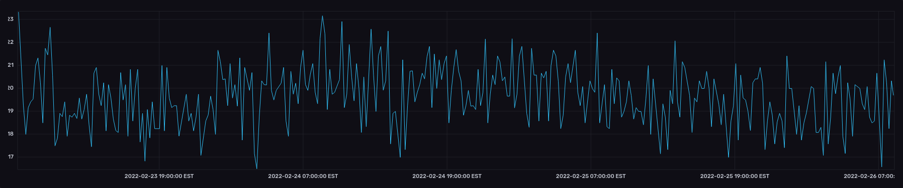

# Introduction

I bought a geiger counter git from adafruit (https://www.adafruit.com/product/483), and before I assembled it, I thought it would be cool if it could upload the data to the internet. I have an influx database and dashboard that I've been streaming temperature, humidity, and barometric pressure to, so I wanted the data to show up there.

For this, I decided to use and Adafruit Feather Huzzah, coupled with an RTC and OLED screen. The feather form factor happens to fit quite nicely in the battery cutout on the stock enclosure.

# Assembly

1) Follow the instructions from the geiger counter kit, but don't solder the battery terminals on. I elected not to install the pin headers and instead solder wires to connect the pulse pin to the arduino.

2) Power, ground, and the pulse pin are connected to power, ground, and pin 15 on the feather. I chose to put them on the top oled shield, but any would work.

3) install a lipo battery with a JST connector to the huzzah board. The geiger counter expects 3 volts from the AA battery cell, so running it off the 3.3 volt rail is no problem.

That's basically it.

I created an API using flask to handle the inserting to the influx database.

The ESP8266 polls the pulse pin, which is held high for ~100 ms whenever a radioactive particle strikes the detector tube.
This increases the "count". Since this type of radiation detector does not discriminate between alpha, beta, and gamma particles, it isn't easy to convert directly to human exposure limits.

Here's an example of the data viewer:

